# NovelMaestro Lite

**Переводчик веб-новелл в браузере.** Установите скрипт — и любая новелла (китайская, английская, японская, вообще с любого языка) переводится на русский прямо на странице, силами нейросети.

Работает **и на компьютере, и на телефоне** — интерфейс сам подстраивается под экран.

Для работы нужен только **ключ API** от любого нейросервисного провайдера. Ничего устанавливать на компьютер не нужно: всё живёт в браузере.

---

## Что умеет

- 📖 **Удобная читалка** — глава открывается как книга: светлый или тёмный фон, свой шрифт и размер текста, листание глав ←/→, оглавление.
- ✨ **Единый глоссарий** — имена героев и термины запоминаются по каждой книге и переводятся одинаково от главы к главе.
- ⚡ **Перевод со стримингом** — текст появляется на экране ещё во время генерации, а следующая глава переводится в фоне заранее и открывается мгновенно.
- 💾 **Продолжение с места остановки** — оборвался интернет или закрылась вкладка: при следующем открытии перевод продолжится, а не начнётся заново.
- 📄 **Экспорт в TXT** — готовую главу можно скачать файлом.

Глоссарий и переводы хранятся в самом браузере, привязаны к сайту книги и переживают перезапуск. Очистка данных сайта в браузере их удалит — глоссарий можно заранее выгрузить в файл на вкладке «Глоссарий».

## Как это выглядит

Кадры ниже — живой прогон: демонстрационная глава переведена моделью `google/gemini-3.1-flash-lite` (сервис routerai.ru) — так же пойдёт перевод и вашей книги.

| Открыли главу — внизу справа кнопка ⋮ | Меню: перевод, термины, книга, обучение, настройки |
| --- | --- |
| 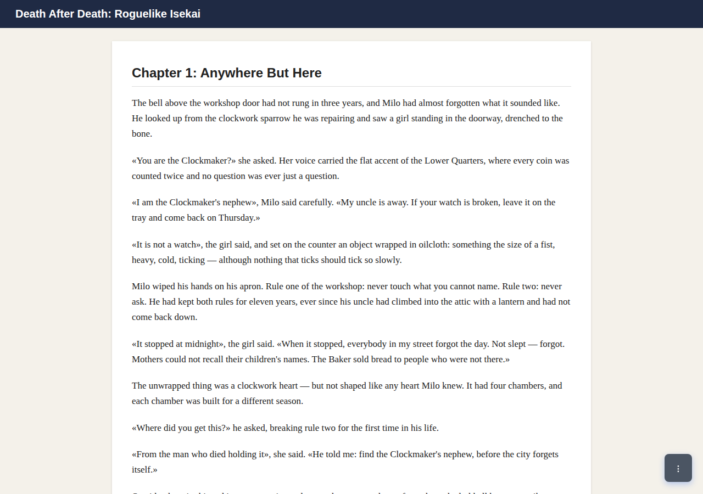 | 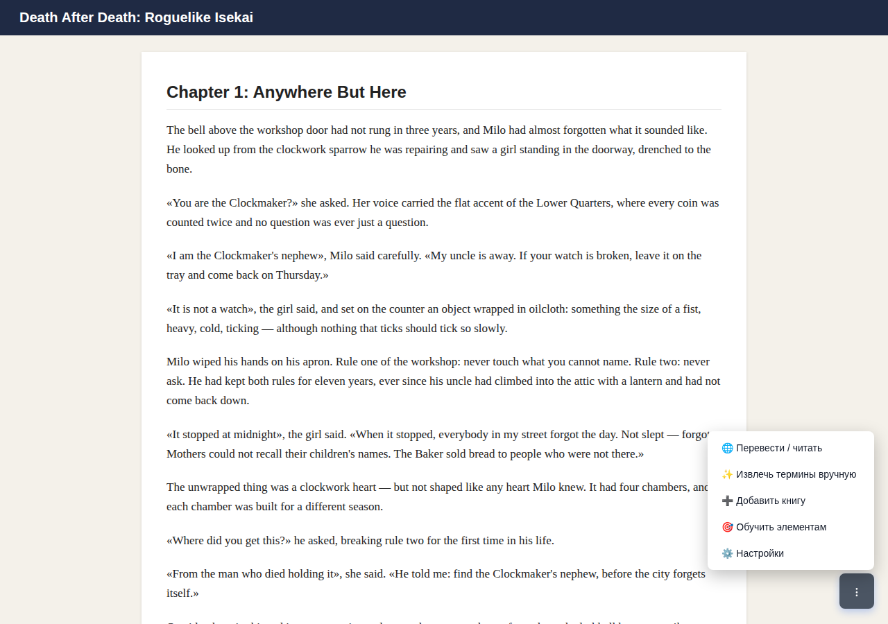 |

| Один раз настроили ключ API — сервер проверен | При первом переводе книга запоминает свой URL |
| --- | --- |
| 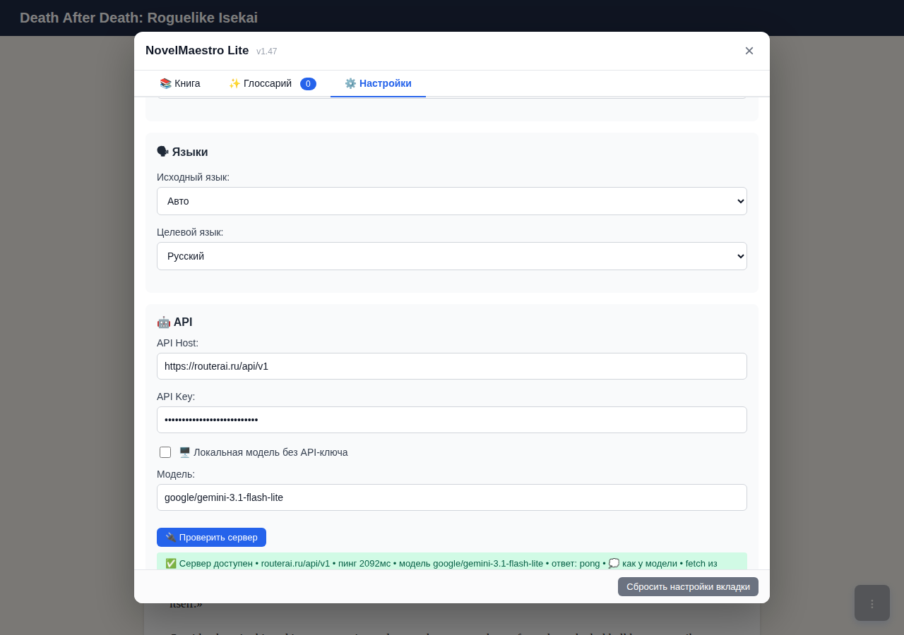 | 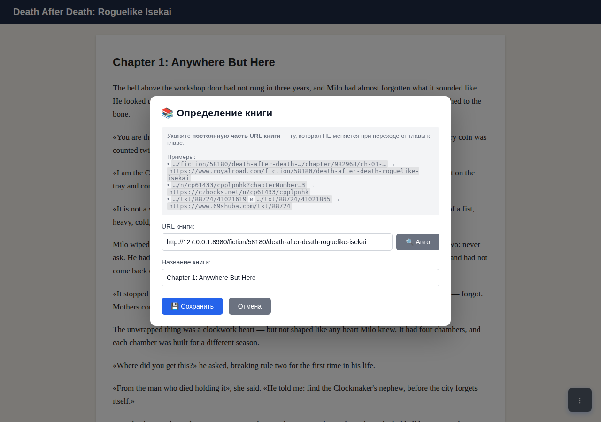 |

| Обучение: показали странице, где текст и кнопки | Текст, «вперёд» и оглавление размечены |
| --- | --- |
| 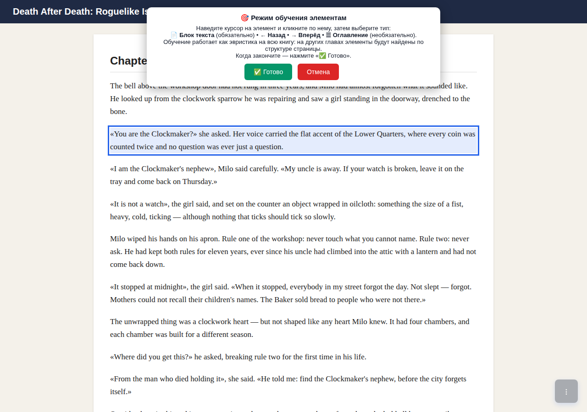 | 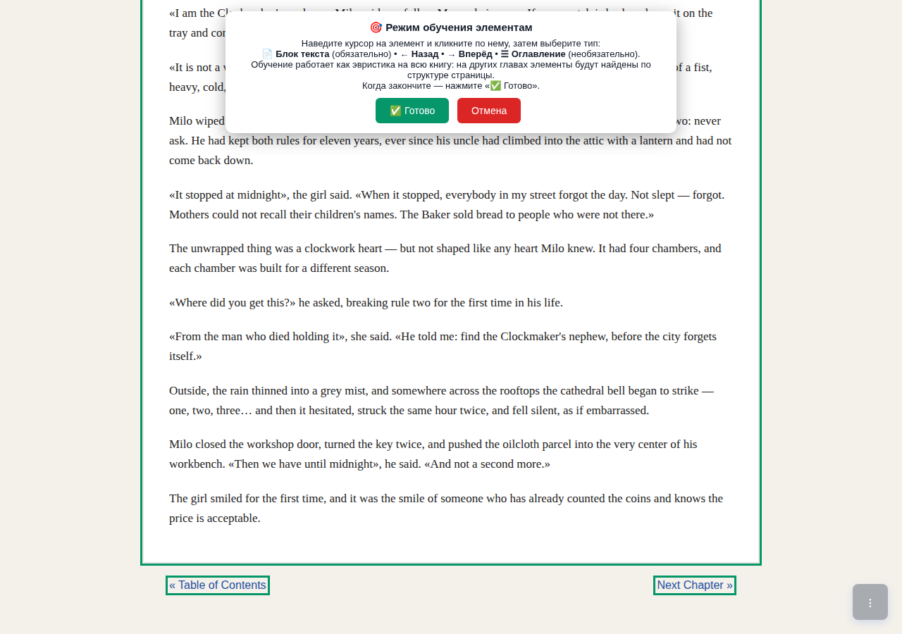 |

| Перевод печатается прямо в читалку | Готовая глава: свой шрифт, размер и тема |
| --- | --- |
| 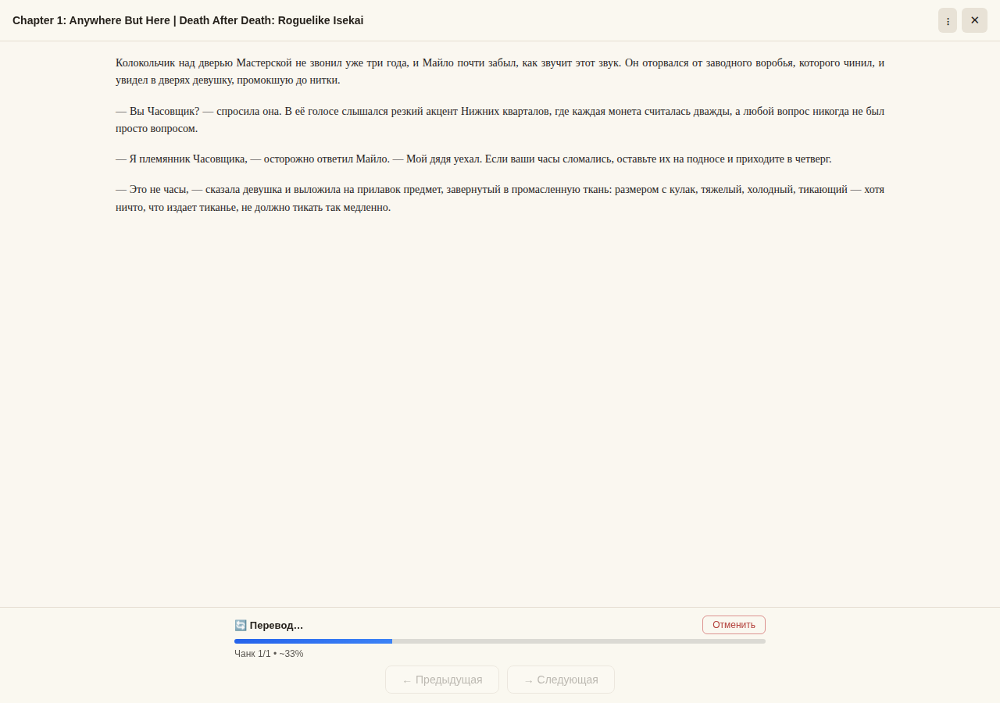 | 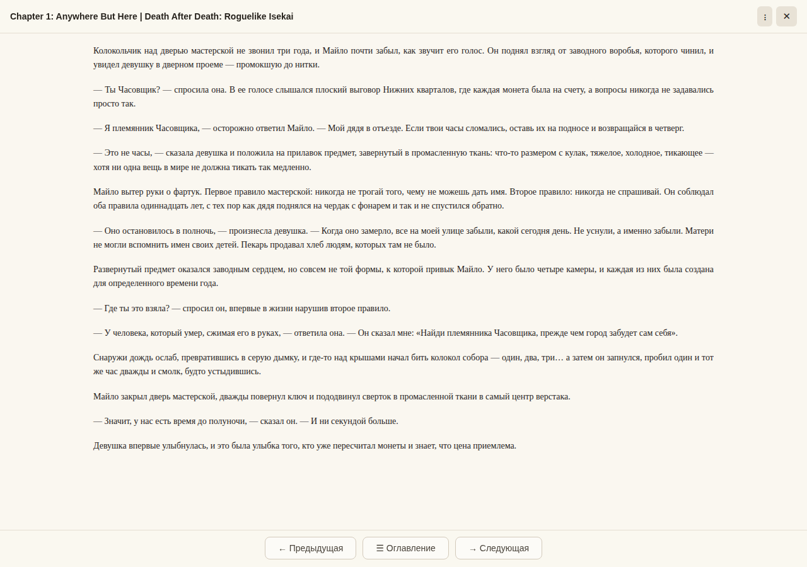 |

| Меню читалки: экспорт TXT, тема, настройки | Следующая глава уже переведена фоном |
| --- | --- |
| 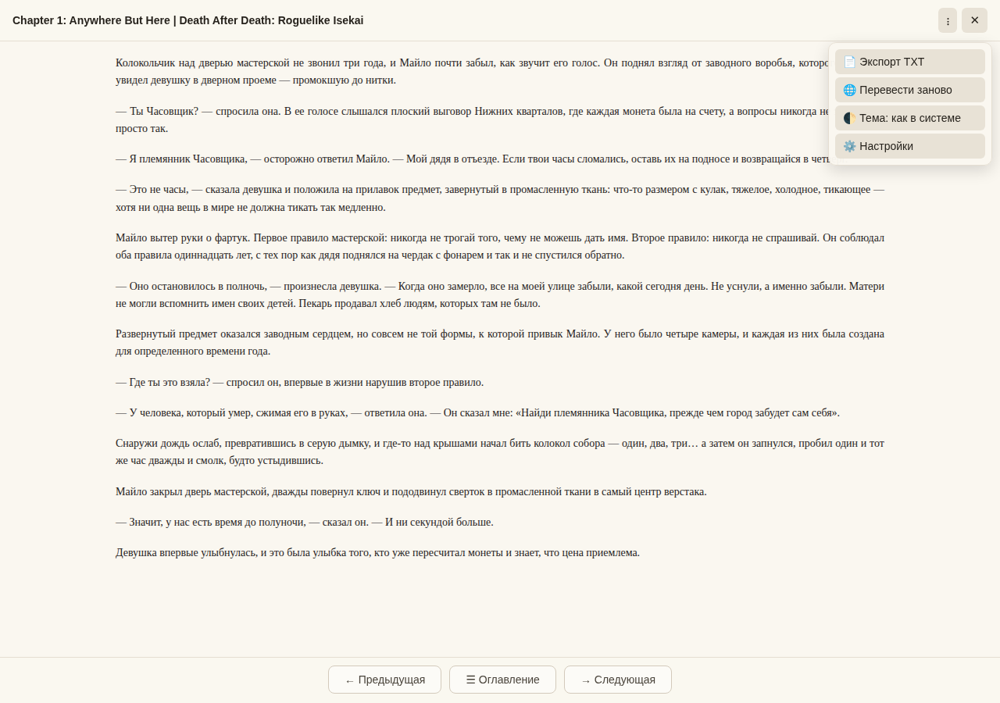 | 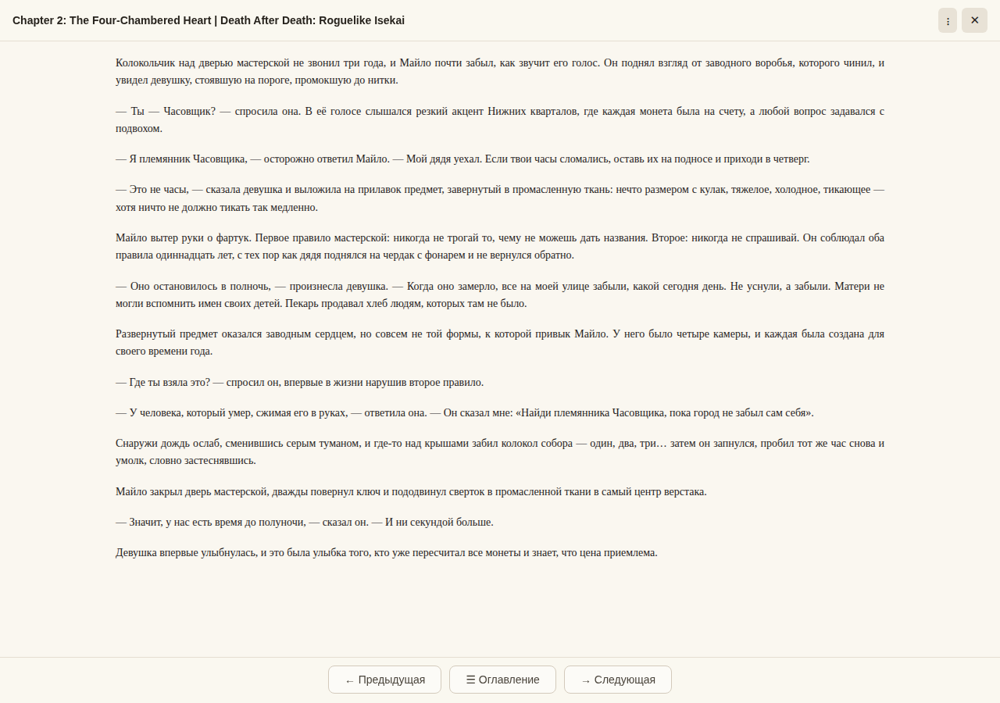 |

| Глоссарий имён пополняется сам | На телефоне — та же кнопка ⋮ |
| --- | --- |
| 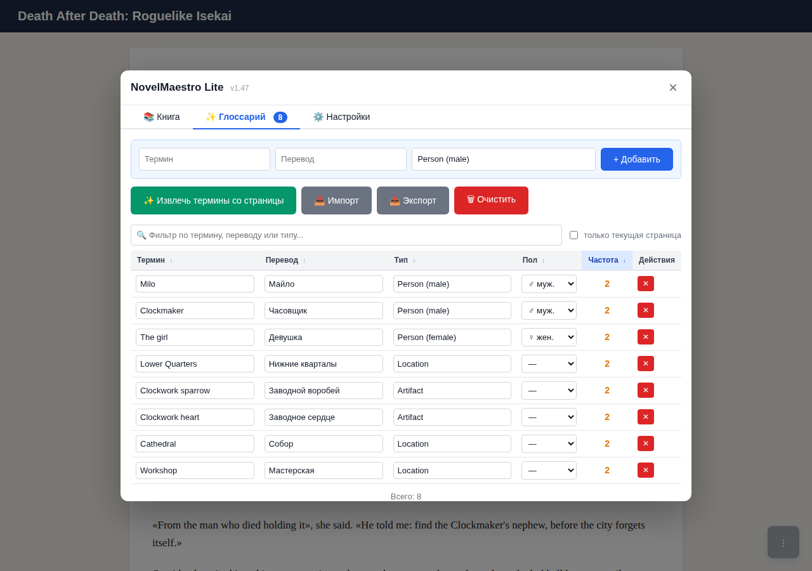 | 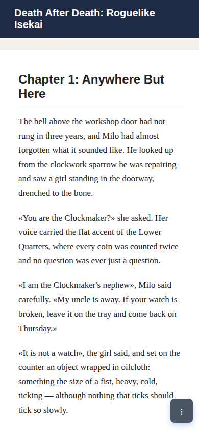 |

| Читалка на телефоне: одна колонка, крупные кнопки под палец |
| --- |
| 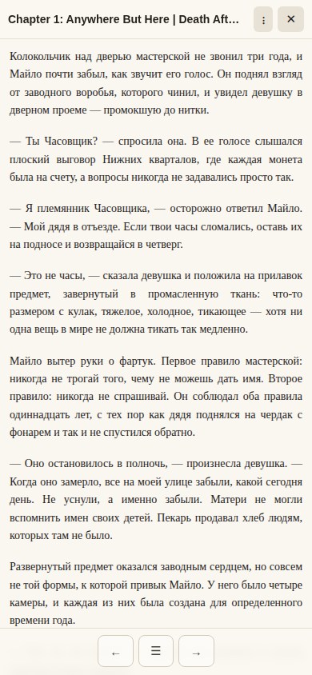 |

## Установка

1. Поставьте в браузер менеджер пользовательских скриптов: **Tampermonkey** или **Violentmonkey** (Chrome, Edge, Firefox — на компьютере и на телефоне; на телефоне удобнее Firefox + Violentmonkey).
2. Откройте ссылку установки — менеджер сам предложит добавить скрипт:
   [https://raw.githubusercontent.com/LynxPDA/NovelMaestro/main/tools/NovelMaestro_Lite/novelmaestro-lite.user.js](https://raw.githubusercontent.com/LynxPDA/NovelMaestro/main/tools/NovelMaestro_Lite/novelmaestro-lite.user.js)
3. Откройте любую страницу — внизу справа появится полупрозрачная кнопка **⋮**.

> Если после установки Violentmonkey ничего не появилось: в Chrome — `chrome://extensions` → Violentmonkey → «Подробности» → включите **«Разрешить пользовательские скрипты»** (в Firefox такого переключателя нет) — и перезапустите браузер.

## Первый запуск

1. Нажмите **⋮ → Настройки** и заполните три поля:
   - **API Host** — адрес провайдера, например `https://api.openai.com/v1`;
   - **API Key** — ваш ключ из личного кабинета (для локальной модели вроде Ollama ключ не нужен — включите «Локальная модель без API-ключа»);
   - **Модель** — её имя, например `gpt-4o-mini`.
2. Нажмите **🔌 Проверить сервер** — должно появиться «✅ Сервер доступен».
3. Откройте главу новеллы и нажмите **⋮ → 🌐 Перевести / читать**.
4. Подтвердите «Определение книги» (адрес подставится сам), затем скрипт попросит **показать страницу**: кликните по блоку основного текста главы — и, если хотите, по кнопкам «вперёд/назад» и оглавлению (на телефоне — двойной тап). После «✅ Готово» перевод начнётся сам.
5. Читайте! Дальше по книге всё происходит в один клик: глоссарий пополняется автоматически, главы листаются кнопками ←/→, меню главы — под **⋮** вверху.

Настройки сохраняются автоматически — заполнить их нужно один раз.

## Если что-то не работает

- **Перевод не начинается, ошибка сети.** Браузер мог не получить разрешение на запросы к вашему провайдеру: панель Tampermonkey → настройки скрипта NovelMaestro Lite → «Безопасность XHR» → добавьте адрес API-хоста (или выберите «Разрешить все домены»).
- **Скрипт не появился после установки.** Проверьте переключатель «Разрешить пользовательские скрипты» у Violentmonkey (см. «Установка»); на телефоне удобнее Firefox + Violentmonkey.
- **Перевод оборвался.** Снова откройте главу и нажмите «🌐 Перевести / читать» — продолжится с места остановки.
- **Где взять ключ API.** Подойдёт любой OpenAI-совместимый сервис: OpenAI, OpenRouter, российские роутеры моделей, локальная модель (Ollama, LM Studio). Адрес и ключ вводятся в настройках скрипта.

Остальное — тонкая настройка, свои промпты, формат глоссария — в [DEVELOPERS.md](DEVELOPERS.md).

## Документация

- [DEVELOPERS.md](DEVELOPERS.md) — техническая документация: все возможности и настройки, детали установки, формат глоссария, исходники и сборка.
- Вопросы и проблемы: [github.com/LynxPDA/NovelMaestro/issues](https://github.com/LynxPDA/NovelMaestro/issues).
